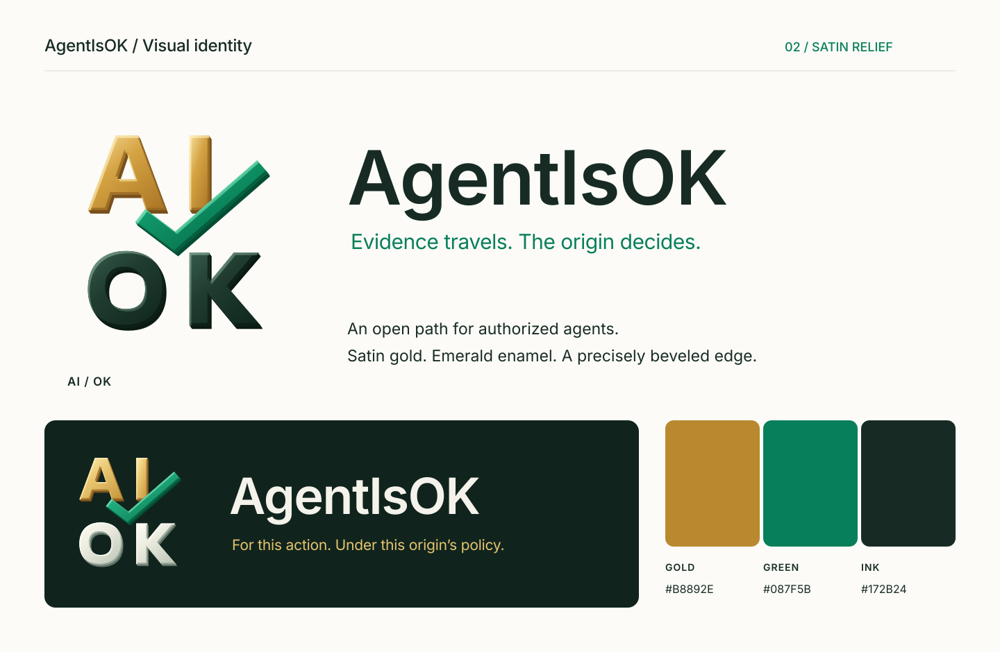

# AgentIsOK identity



The primary mark stacks **AI** over **OK**. A green check passes through the center gap and rises beside the I. The polished treatment adds satin gold faces, emerald shading, fine bevels, and a shallow lower-right edge. The letter silhouettes, spacing, and check composition retain the original identity. Gold, deep green, and simple angular geometry echo Univeracity's visual family; the letterforms and composition are specific to AgentIsOK.

The wordmark is **AgentIsOK**, with that capitalization. The technical specification remains **Agent Clearance Protocol** and uses `agent-clearance` identifiers.

## Assets

| Use | Light surface | Dark surface |
|---|---|---|
| Horizontal logo | [SVG](agentisok-logo-light.svg) · [PNG](agentisok-logo-light.png) | [SVG](agentisok-logo-dark.svg) · [PNG](agentisok-logo-dark.png) |
| Stacked mark | [SVG](agentisok-mark-light.svg) · [PNG](agentisok-mark-light.png) | [SVG](agentisok-mark-dark.svg) · [PNG](agentisok-mark-dark.png) |
| Flat logo for small displays | [SVG](agentisok-logo-light-flat.svg) | [SVG](agentisok-logo-dark-flat.svg) |
| Flat stacked mark | [SVG](agentisok-mark-light-flat.svg) · [PNG](agentisok-mark-light-flat.png) | [SVG](agentisok-mark-dark-flat.svg) · [PNG](agentisok-mark-dark-flat.png) |
| Single color | [Logo SVG](agentisok-logo-mono.svg) | [Mark SVG](agentisok-mark-mono.svg) — recolor the entire mark as needed |

- [Avatar SVG](agentisok-avatar.svg) and [512 × 512 PNG](agentisok-avatar.png).
- [Favicon SVG](agentisok-favicon.svg) and [64 × 64 PNG](agentisok-favicon.png); simplified AI + check for small contexts.
- [Social preview SVG](agentisok-social.svg) and [1280 × 640 PNG](agentisok-social.png), ready for a repository social-preview upload.
- [Specimen SVG](agentisok-specimen.svg) and [PNG](agentisok-specimen.png).
- [Before-and-after SVG](agentisok-refinement.svg) and [PNG](agentisok-refinement.png).
- [3D material study PNG](agentisok-studio-concept.png) and [generation prompts](studio-prompt.md), exploring satin gold and emerald enamel with the built-in image generator.

SVGs are self-contained, with outlined lettering and accessible titles/descriptions. Dimensional SVGs use vector gradients, masks, and shallow offset faces; they have no embedded bitmap or lighting-filter dependency. PNG marks and horizontal logos have transparent backgrounds. The avatar and social preview have a fixed deep-green background.

## Color and placement

| Role | Light surface | Dark surface |
|---|---|---|
| AI / gold | `#B8892E` | `#E7C46F` |
| Check / green | `#087F5B` | `#43C995` |
| Lettering | `#172B24` | `#F4F2EA` |
| Suggested background | `#FCFBF7` | `#10241D` |

Preserve the proportions and internal spacing. Keep surrounding content at least one letter-stem width away from the mark. Use the dimensional stacked mark at 96 px wide or larger, the flat mark from 48–95 px, and the simplified favicon below that. Use the dimensional horizontal logo at 360 px wide or larger and the flat logo from 240–359 px. Gold is an identity accent, not the default color for small body text.

## Meaning and use

**Evidence travels. The origin decides.**

The check identifies the project. It does not certify an agent, issuer, implementation, or deployment as safe or conformant. When used beside a real decision, state the action and origin policy, and render denial, step-up, and indeterminate outcomes explicitly. A static green logo must never substitute for the actual decision.

These assets follow the repository's [Apache-2.0 license](../../LICENSE). Truthful project references and compatibility descriptions do not require a hosted service or paid program. Do not imply project endorsement, certification, or official status for an independent implementation.

## Rebuild

The original monogram and dimensional treatment are defined in [generate.py](generate.py). Fine highlights follow both outer contours and letter counters, with consistent light from the upper left. The wordmark uses [Inter](https://rsms.me/inter/) under its SIL Open Font License; no font binaries are bundled. Generated lettering is outlined, so viewing the assets does not require Inter.

To regenerate, install Inter, Inkscape, and `rsvg-convert`, then run from the repository root:

```bash
python3 assets/brand/generate.py
```

Inspect the PNG specimen, social preview, and small favicon after regeneration. Font and renderer versions can change outlines; commit the reviewed outputs together with source changes.
